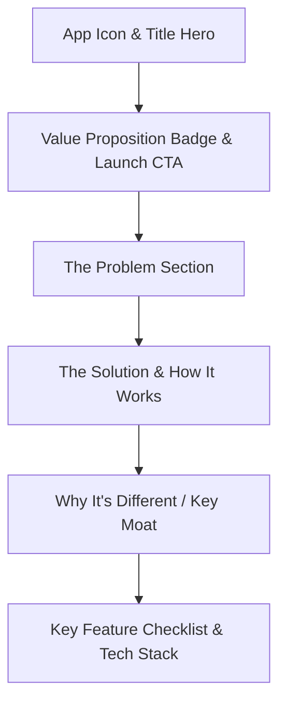

# Value Proposition, Differentiation & Onboarding Strategy Proposal

Comprehensive analysis of all applications across the **catherina.dev** portfolio and the **Practice Mate** ecosystem, derived directly from local codebase inspections (`bright-sight`, `score-tone`, `practice-mirror`, `practice-mate`, `spot-practice`, `click-up`, `koh-pilot`, `rhythm-weaver`, `scaled`, `pitch-mate`, `oikaze`, and `retrogram`).

---

## Executive Summary

- **Context**: The applications in this portfolio were originally built as personal tools to solve concrete daily practice, performance, and workflow pain points.
- **Goal**: Clarify each app's core value proposition, articulate what makes it technically and methodologically distinct, and outline high-impact onboarding strategies to market them effectively to external musicians, students, teachers, and general users.
- **Core Theme**: High-focus, privacy-first, zero-bloat utilities powered by cognitive neuroscience, acoustic engineering, and browser-native performance (WebAssembly, Web Audio API, SVG filters, PWA offline caching).

---

## Part 1: App-by-App Analysis & Value Propositions

---

### 1. Bright Sight (`bright-sight`)
*AI-Powered Graded Classical Guitar Sight-Reading*

#### The Problem
Classical guitarists struggle to develop sight-reading proficiency because grade-appropriate study material is severely limited:
- Syllabus books (ABRSM, Trinity) provide only 20–30 short excerpts per grade. After 1–2 readings, the pieces are memorized rather than read.
- Generic sight-reading web apps produce single-melody lines or random pitches designed for piano or voice. They fail on guitar because they ignore fretboard mechanics: string positions (I–IX), fingerboard shifts, polyphonic voice separation (thumb bass vs. fingers melody), and playable harmonic voicings.

#### The Solution & Value Proposition
Bright Sight generates **infinite, non-memorizable, syllabus-compliant classical guitar exercises** on demand using Google Gemini AI, governed by strict pedagogical rulesets:
- Never run out of sight-reading exercises at your exact grade level.
- Develop true reading reflex rather than muscle memory recall.
- Practice in real time with vector sheet music and a synchronized audio metronome cursor.

#### Codebase Insights & Technical Differentiation
- `constants/gradeRules.ts`: Hardcoded pedagogical syllabus constraints defining note ranges, string restrictions, allowed accidentals, rhythmic vocabulary, and polyphonic textures from Grade 1 (open strings/first position) to Grade 8 (counterpoint, high positions, polyphony).
- `services/musicComposer.ts` & `services/geminiService.ts`: Specialized prompt chains producing strictly formatted MusicXML rendered through OpenSheetMusicDisplay (OSMD).
- `components/ScoreDisplay.tsx`: Synchronized Web Audio API playback engine with visual tempo cursor tracking.
- **Differentiation vs. Alternatives**: Unlike Sight Reading Factory or generic apps, Bright Sight is **pedagogically native to the classical guitar**.

#### Ready-to-Use Copy for About Page / Catalog
> **Tagline**: Stop memorizing. Start sight-reading. Infinite AI-generated classical guitar exercises for Grades 1–8.  
> **Problem**: Traditional syllabus sight-reading books run out of material in two weeks. Once played, you are testing memory—not sight-reading.  
> **Solution**: Generates infinite, syllabus-accurate MusicXML exercises strictly tailored to classical guitar fretboard mechanics, complete with live sheet music rendering and metronome tracking.  
> **Differentiation**: Governed by strict classical guitar pedagogical rules (positions, voice separation, note ranges) rather than random pitch algorithms.


#### Updated Key Features (Code-Verified)
- AI-Generated Classical Guitar Exercises: Unlimited syllabus-accurate MusicXML exercises tailored for Grades 1–8.
- Pedagogical Fretboard Rules: Strict algorithmic constraints governing position shifts (I–IX), string restrictions, and polyphonic voice separation.
- Interactive Web Audio Playalong: In-browser Web Audio synthesis of exercise pitches with volume and tempo controls.
- Dynamic OSMD Sheet Music: Crisp vector notation with real-time synchronized playback cursor.
- Keyboard Hotkey Navigation: Seamless hands-on-guitar control (Space for play/pause, Left Arrow to rewind, Esc to dismiss).
- Practice Goals & Bookmarking: Set daily target goals with celebration confetti and bookmark exercises for structured review.

#### Onboarding & Marketing Strategy
1. **Frictionless Guest Flight**: Enable 1-click generation and playback of a Grade 1 exercise directly on the landing page without requiring account registration.
2. **"Find Your Grade" Quick Quiz**: A 30-second, 3-question diagnostic ("Can you read beyond 5th position? Can you balance two independent voices?") that selects the optimal starting grade.
3. **Lead-in Metronome Visualizer**: Add a prominent 4-beat audio/visual countdown before the cursor starts advancing across the staff to settle the player.

---

### 2. ScoreTone (`score-tone`)
*Eye-Friendly Sheet Music Reader with PDF Deep Linking & MusicXML Spot Practice*

#### The Problem
Standard PDF readers (Adobe Acrobat, Apple Preview, web browsers) and existing sheet music apps fail on music stands:
- Harsh, brilliant white digital backgrounds produce intense eye strain during multi-hour practice sessions and glare blindingly in dark rehearsal halls.
- Scanned, vintage, or handwritten sheet music often has faint, washed-out grey staff lines that are unreadable at stand distance (3–4 feet away).
- Proprietary apps lock users to a single hardware ecosystem (Apple only), require expensive subscriptions, and force users to navigate clumsy, proprietary file sharing.
- Musicians cannot easily share an exact page, rehearsal mark, or looped practice spot with students or rehearsal partners.
- Traditional sheet music apps treat scores as dead static images—they cannot play back notation or loop difficult measures.

#### The Solution & Value Proposition
ScoreTone transforms any tablet, laptop, or phone into an **eye-friendly, cross-platform music stand and interactive practice workstation**:
- Eliminates eye fatigue with curated reading palettes (Warm Paper, Sepia, Ivory, Night Mode, Stage Dim) and mathematical ink restoration that pulls faint grey scans into crisp pitch-black notation.
- Provides versatile display ergonomics (2-page landscape, fit-to-width, continuous vertical scroll, and full-screen).
- Enables instant rehearsal sharing through direct URL deep linking to exact scores and page numbers.
- Bridges the gap between static PDFs and interactive practice: upload MusicXML/MXL scores, play them back with synthesized Web Audio, and set custom loops to master bottlenecks.

#### Head-to-Head: Why ScoreTone is Better Than forScore

| Feature / Dimension | forScore | ScoreTone |
| :--- | :--- | :--- |
| **Platform & Hardware** | **Apple Only** (Locked to iPadOS/iOS/macOS). Useless if you or your students have Android, Windows, or Linux. | **100% Cross-Platform PWA**. Runs identically on iPads, Android tablets (Samsung Galaxy Tab), Windows Surface, Chromebooks, Macs, and phones. |
| **Pricing & Monetization** | **Paid Upfront ($19.99+) + Annual "forScore Pro" Subscription** ($9.99/yr) for advanced features. | **100% Free & Open-Web**. Zero paywalls, zero subscriptions, zero ads. |
| **Sharing & Collaboration** | **Proprietary & Clunky**: Requires exporting flattened multi-MB PDFs or proprietary `.4sb` archives that only other paid forScore users can view. | **Instant URL Deep Linking**: Share a link (`?driveId=...&page=14`) that opens directly to the exact score and page number in any browser on any device. |
| **Score Formats & Interactivity** | **Static Files Only**: Strictly renders PDFs and images. Cannot parse note data, synthesize audio, or loop passages. | **Dual-Engine (PDF + MusicXML)**: Renders static PDFs *and* parses interactive MusicXML with Web Audio pitch synthesis and measure looping. |
| **Spot Practice Looping** | **None**: You can only stare at a static PDF and manually stop/start an external audio app. | **Measure-Based Spot Loops**: Set in/out measure boundaries (`loopStartM` to `loopEndM`), loop difficult passages continuously with metronome lead-ins, and save loops as bookmarks. |
| **Ink Restoration & Contrast** | **Rudimentary**: Standard brightness/contrast sliders or basic invert that blow out backgrounds and wash out notation. | **Mathematical SVG Ink Curves**: Custom non-linear transfer curves pull faint grey scanned notation lines to pure pitch-black without muddying the paper background. |
| **Storage & Privacy** | **Trapped in Sandbox**: Scores are duplicated into an internal iPad app sandbox that inflates device storage. | **Zero Storage Traps**: Streams directly from your Google Drive using ephemeral in-memory tokens, or caches selected files into browser IndexedDB (Dexie). |

#### Codebase Insights & Technical Differentiation
- **Mathematical Ink Restoration (`SvgFilters.tsx`)**: Custom SVG filter curves stretch faint grey notation lines to pitch black without washing out the paper texture or darkening white backgrounds.
- **Musician-Tuned Display Presets & Layouts**: Built-in optical modes (*Warm Paper*, *Sepia*, *Ivory*, *Night Mode*, *High Contrast*, *Stage Dim*) plus responsive 2-page landscape view and continuous vertical scrolling.
- **URL Deep Linking Architecture (`App.tsx`, `ViewerPage.tsx`)**: Synchronizes view states with URL search parameters (`?driveId=...&page=...` and `?view=...&loopStartM=...&loopEndM=...`), allowing instant jump navigation from external links.
- **Interactive MusicXML Playback & Looping (`MusicXmlViewer.tsx`, `audioPlaybackService.ts`)**: In-browser Web Audio synthesis with dynamic measure range isolation (`applyLoopRange`), loop wrap-around, and bookmarking.
- **Offline IndexedDB Architecture (`storageService.ts`)**: Uses Dexie to store PDF and MusicXML binaries locally with visual offline status indicators.
- **Screen Wake Lock Integration (`useWakeLock.ts`)**: Prevents your screen from dimming or locking while reading music.

#### Ready-to-Use Copy for About Page / Catalog
> **Tagline**: The eye-friendly sheet music reader with PDF deep linking and MusicXML spot practice.  
> **Problem**: Standard PDF readers and expensive locked-down apps like forScore blind you with white glare, trap your scores in Apple-only sandboxes, and treat sheet music as dead static images.  
> **Solution**: A cross-platform PWA featuring eye-strain reduction palettes (Warm Paper, Sepia, Night Mode), mathematical ink restoration for faint scans, instant URL deep linking to exact pages, and MusicXML playback with practice loops.  
> **Differentiation**: Cross-platform freedom (iPad, Android, Windows, Mac), zero subscriptions, instant web deep linking, and a dual-engine architecture supporting interactive MusicXML looping.

#### Updated Key Features (Code-Verified)
- **Eye-Strain Reduction & Ink Darkener**: Curated visual comfort palettes (Warm Paper, Sepia, Ivory, Night Mode, Stage Dim) paired with mathematical SVG filter curves that stretch faint, vintage scans into crisp pitch-black notation without blinding glare.
- **Flexible Display Options**: Multiple layout modes including automatic 2-Page Landscape side-by-side view, Fit-to-Width, Fit-to-Height, continuous vertical scroll, and distraction-free full-screen reading.
- **Deep Linking into PDF & Scores**: Direct shareable URLs (`?view=...&page=...`) that open straight to an exact score and page number or rehearsal mark, allowing instant collaboration with students and rehearsal partners.
- **MusicXML Score Upload with Playback & Practice Loops**: Upload interactive MusicXML/MXL scores to render crisp vector sheet music, play along with Web Audio pitch synthesis, and set measure-based loop ranges for targeted spot practice.
- **Section Bookmarks & Fast Rehearsal Navigation**: Create, label, and jump between custom rehearsal marks, structural sections, or practice loops within multi-page scores.
- **Offline-First PWA & Screen Wake Lock**: Instant IndexedDB (Dexie) local caching for reliable offline rehearsals, with Screen Wake Lock that prevents your screen from dimming or locking while reading music, and ephemeral Google Drive picker streaming.

#### Onboarding & Marketing Strategy
1. **Bundled Public-Domain Sample Score**: Pre-load a sample score (e.g. Bach Prelude) so new visitors can test the Ink Darkener, Warm Paper preset, and 2-page flip in 5 seconds without searching for a PDF file.
2. **Interactive Loop Demo**: Include a pre-loaded 4-measure MusicXML spot loop showing how the audio playback and loop repetition work.
3. **"Switching from forScore" Callout**: Highlight cross-platform accessibility and instant web deep-linking: *"Open scores on any device—iPad, Android tablet, or laptop—with zero app installations and no subscription fees."*
4. **Drive Privacy Callout**: Place a trust badge by the Google Drive button: *"Your scores remain 100% private. Files are streamed directly to your local browser storage and never touch a remote server."*

---

### 3. Practice Mirror (`practice-mirror`)
*Latency-Free Visual Feedback & Browser Video Trimmer*

#### The Problem
Musicians need visual feedback to correct posture, bow arm angle, left-hand wrist tension, and embouchure:
- Physical mirrors cannot record, meaning you miss flaws occurring while you read the score.
- Standard smartphone camera apps record huge 4K files that rapidly fill device storage, cannot easily be trimmed without third-party software, and take forever to upload.
- Sending practice clips to a teacher or coach involves tedious compression and file transfers.

#### The Solution & Value Proposition
Practice Mirror is a **private, zero-latency visual practice mirror and self-evaluation recorder**:
- Check mechanics in real time with zero stream delay.
- Record practice runs and trim them immediately in the browser using client-side WebAssembly.
- Upload unlisted videos directly to your YouTube channel with one click to share with teachers.

#### Codebase Insights & Technical Differentiation
- **Client-Side WASM Processing**: Integrates WebAssembly FFmpeg inside the browser (`app.js`, `server.js` with COEP/COOP headers) to trim and transcode videos locally on the user's hardware.
- **Zero Server Footprint**: Recordings never pass through an intermediary server—eliminating hosting costs and guaranteeing absolute privacy.
- **Direct YouTube Upload Integration**: Authenticates via Google Identity Services and uploads directly to the user’s personal YouTube channel as unlisted or private clips.
- **Differentiation vs. Alternatives**: Unlike video recording platforms (Loom, Vidyard) or phone camera rolls, Practice Mirror is **tailored for instrumentalists**: zero latency, local browser video editing, and instant teacher-link generation with no cloud video subscription.

#### Ready-to-Use Copy for About Page / Catalog
> **Tagline**: Zero-latency visual feedback, local clip trimming, and one-click teacher sharing.  
> **Problem**: Smartphone cameras fill up phone storage with gigabytes of unedited footage, and physical mirrors can't record your mistakes while you read the score.  
> **Solution**: A latency-free browser mirror that records practice takes, trims them locally on your device via WebAssembly, and uploads directly to YouTube as unlisted clips.  
> **Differentiation**: 100% private client-side video processing (no cloud servers holding your media) with direct one-click instructor sharing.


#### Updated Key Features (Code-Verified)
- Latency-Free Visual Mirror: Real-time canvas feed for studying posture, bow alignment, hand position, and embouchure.
- In-Browser WASM Trimming: Client-side video trimming and transcoding powered by WebAssembly (FFmpeg) with zero server uploads.
- One-Click Unlisted YouTube Upload: Direct Google OAuth integration to publish private/unlisted clips for teacher evaluation.
- Pre-Roll Countdown & Stand Controls: Lead-in recording countdown, audio VU level meter, and quick-rewind buttons.
- Multi-Camera & Audio Input Selection: Seamlessly switch between external USB microphones, webcams, and built-in hardware.
- 100% Private & Offline-Capable: Zero cloud storage footprint—recordings remain strictly on local storage until exported.

#### Onboarding & Marketing Strategy
1. **Privacy Shield Guarantee**: Display an upfront notice before requesting camera permissions: *"Practice Mirror processes all video locally in your browser. No video is ever stored or viewed by our servers."*
2. **5-Second "Test Run" Flow**: Prompt new users to record a quick 5-second sample to experience the instant drag-handle trimming and preview.
3. **Teacher Lesson Preset**: Provide a default YouTube title/description template (e.g. `[Piece Name] - Bar [X-Y] - Practice Take - [Date]`).

---

### 4. Practice Mate (`practice-mate` / `practice-timer`)
*Structured Practice Session Engine & Segment Timer*

#### The Problem
General productivity timers (Pomodoro apps, Forest, Focus Keeper) fail musicians:
- Instrument practice is not a monolithic desk task; it consists of multiple distinct segments (scales, etudes, repertoire polishing, sight-reading).
- Standard timers turn off the screen after 1–2 minutes, forcing musicians to drop their instrument and touch the screen with sweaty or occupied hands.
- Rigid timers lack "overtime" flexibility when you are in the zone working through a difficult passage.

#### The Solution & Value Proposition
Practice Mate is a **structured practice manager built specifically for instrument workflows**:
- Break your daily practice block into dedicated piece segments with individual countdown goals.
- Keep your screen awake on the music stand hands-free.
- Track cumulative minutes, build multi-week consistency, and export practice logs for teachers.

#### Codebase Insights & Technical Differentiation
- **Dedicated Segment Timer**: Supports per-piece countdown goals within an overall session, complete with automated progression and overtime mode.
- **Screen Wake Lock API**: Actively prevents mobile and tablet displays from dimming or locking while a session is active.
- **Web Worker Timing Engine**: Uses dedicated Web Workers to ensure millisecond-precise timing that never drifts when the browser tab is minimized.
- **Repertoire Management**: Associates practice logs with repertoire items, personal study notes, score links, and reference YouTube videos.
- **Differentiation vs. Alternatives**: Generic Pomodoro apps do not understand repertoire or multi-segment instrumental routines. Practice Mate is **built around the anatomy of a music practice session**.

#### Ready-to-Use Copy for About Page / Catalog
> **Tagline**: The dedicated practice routine timer, segment planner, and repertoire logger for musicians.  
> **Problem**: Standard Pomodoro timers don't understand multi-part music sessions, lock your screen while your hands are on the instrument, and fail to track repertoire progress.  
> **Solution**: A musician-engineered timer featuring per-piece segment countdowns, screen wake lock for music stands, drag-and-drop routines, and cumulative analytics.  
> **Differentiation**: Combines drift-free Web Worker timing, stand-friendly wake lock, and structured repertoire tracking.


#### Updated Key Features (Code-Verified)
- Musician-Specific Segment Timer: Per-piece countdown intervals with overtime leeway mode and automatic progression.
- Structured Routine Planner: Drag-and-drop practice routine builder with rich notes, score links, and embedded YouTube references.
- Screen Wake Lock & iOS Background Audio: Prevents screen dimming on music stands and maintains timing accuracy across mobile devices.
- Repertoire Knowledge Hub: Catalog active pieces, maintenance items, tempo targets, and teacher lesson notes in one workspace.
- Shareable Teacher Reports: Generate shareable practice summaries and weekly consistency heatmaps for lesson accountability.
- Pomodoro Cycle Tracking: Configurable work/break iteration tracking powered by drift-free Web Workers.

#### Onboarding & Marketing Strategy
1. **Pre-Built Starter Routines**: Eliminate blank-canvas paralysis by offering 3 one-click starter routines:
   - *30-Min Maintenance* (5m Warmup, 10m Scales, 15m Repertoire)
   - *60-Min Deep Study* (10m Technique, 20m Etudes, 25m Pieces, 5m Run-through)
   - *Free Practice* (Open timer with hands-free wake lock)
2. **Stand Ergonomics Callout**: Highlight *"Screen stays awake while timer runs"* during first launch.
3. **Teacher Export**: Promote the *"Export Practice Summary"* feature as an accountability tool for weekly lessons.

---

### 5. Spot Practice (`spot-practice`)
*Difficult Passage Isolation & Interleaved Drill*

#### The Problem
The most common mistake in music practice is "playing through from the top":
- When musicians encounter a difficult measure, they stumble, replay it once poorly, and keep going to the end of the piece.
- This wastes 80% of practice time playing easy bars already mastered and reinforces motor errors on the hardest passages.
- Reading from a full score creates visual clutter and cognitive fatigue when trying to master a short bottleneck.

#### The Solution & Value Proposition
Spot Practice is a **surgical passage isolation tool**:
- Upload your MusicXML/MXL scores and isolate exact 2, 3, 4, 8, or 12-bar segments.
- Eliminate visual clutter so your eyes and brain focus exclusively on the bottleneck.
- Drill passages with randomized interleaved sequencing to lock in reliable motor recall.

#### Codebase Insights & Technical Differentiation
- **Score Parsing & Measure Isolation**: Uses OpenSheetMusicDisplay (OSMD) to parse MusicXML data and extract isolated measure ranges cleanly onto an uncluttered canvas.
- **Interleaved Randomization Engine**: Shuffles between selected passage spots so the brain cannot rely on rote sequential prediction.
- **Differentiation vs. Alternatives**: Rather than acting as a passive score viewer, Spot Practice **enforces deliberate practice discipline** by physically removing the rest of the score.

#### Ready-to-Use Copy for About Page / Catalog
> **Tagline**: Stop playing from the top. Isolate and conquer your hardest passages.  
> **Problem**: Running entire pieces from start to finish wastes time and cements mistakes on the few measures that actually need work.  
> **Solution**: Upload your MusicXML score to isolate specific 2-to-12 measure bottlenecks onto a distraction-free canvas and practice them with randomized interleaved repetition.  
> **Differentiation**: A focused, measure-level practice environment that physically eliminates score clutter to accelerate technical mastery.


#### Updated Key Features (Code-Verified)
- Targeted Measure Isolation: Surgically isolate 2, 3, 4, 8, or 12-bar segments from MusicXML/MXL scores to eliminate score clutter.
- Interleaved Randomization Mode: Shuffles isolated trouble spots non-sequentially to build true motor recall.
- Interactive Vector Notation: Crisp sheet music rendering via OpenSheetMusicDisplay (OSMD) with responsive layout resizing.
- Context Toggle & Score Zoom: Switch instantly between isolated bottleneck view and full-score context with zoom controls.
- Distraction-Free Stand Interface: Large measure indicators and high-contrast notation optimized for music stands.

#### Onboarding & Marketing Strategy
1. **Pre-Loaded Classical Excerpt**: Ship with a pre-loaded challenging classical excerpt (e.g. a tricky passage from Tarrega or Bach) so users can test passage isolation and zoom immediately without hunting for a MusicXML file.
2. **The "Why Isolate?" Micro-Guide**: A 2-sentence prompt explaining the neuroscience of bottleneck isolation and interleaving.

---

### 6. Click Up (`click-up`)
*Interleaved Tempo Progression & Speed Builder*

#### The Problem
The traditional method for building speed—setting a metronome slow and increasing it by 2 bpm linearly—is scientifically flawed:
- Linear acceleration creates physical tension, stiffness, and motor plateaus.
- The human brain learns motor patterns more efficiently when target speeds are introduced in short bursts alternating with slower baseline intervals.

#### The Solution & Value Proposition
Click Up is an **advanced speed-building tool based on cognitive neuroscientist Dr. Molly Gebrian’s interleaved practice research**:
- Automates non-linear tempo cycles: alternates between baseline tempos, high-speed micro-bursts, and recovery steps.
- Builds velocity and precision while preventing physical tension and mental burnout.

#### Codebase Insights & Technical Differentiation
- **Scientific Methodology in Code**: Encodes Dr. Molly Gebrian's interleaved learning curves directly into automated tempo scheduling.
- **MusicXML Integration**: Renders isolated measure excerpts synchronized with the automated stepped metronome.
- **Context Cycle Variations**: Shifts metronome subdivisions and repetition counts between tempo jumps.
- **Differentiation vs. Alternatives**: Standard metronomes only offer linear speed training. Click Up is the **only practice tool implementing Molly Gebrian's cognitive tempo interleaving**.

#### Ready-to-Use Copy for About Page / Catalog
> **Tagline**: Build velocity without tension. Interleaved tempo progression based on cognitive neuroscience.  
> **Problem**: The traditional "bump the metronome by 2 bpm" approach causes muscular tension, fatigue, and speed plateaus.  
> **Solution**: Implements Dr. Molly Gebrian’s interleaved practice method, automating structured cycles between baseline tempos, high-velocity bursts, and recovery tempos.  
> **Differentiation**: The only tempo trainer engineered directly from cognitive music neuroscience research rather than linear metronome ladders.


#### Updated Key Features (Code-Verified)
- Molly Gebrian Cognitive Method: Operationalizes interleaved tempo progression research to build velocity without muscle tension.
- Automated Non-Linear Tempo Stepping: Cycles through high-speed micro-bursts, baseline tempos, and recovery intervals.
- Measure-Based MusicXML Isolation: Isolates challenging runs directly inside the interactive tempo trainer.
- Context & Subdivision Variations: Automatically shifts metronome subdivisions and repetition counts between tempo jumps.
- Stand-Optimized Single-Screen UI: Fast BPM increment stepping designed for effortless adjustment during practice.

#### Onboarding & Marketing Strategy
1. **The 30-Second Science Visualizer**: A simple comparative graphic: *Linear 2-bpm ladder (slow, causes tension) vs. Interleaved burst cycling (fast, promotes relaxation).*
2. **One-Click Progression Presets**: Provide pre-configured curves: *"The Speed Burst Cycle"*, *"The Stability Wave"*, and *"The Endurance Pyramid"*.

---

### 7. Practice Koh-Pilot (`koh-pilot`)
*Consecutive Clean Repetition Accountability*

#### The Problem
Musicians constantly fall victim to the "illusion of competence":
- Playing a passage 10 times, getting it right once by luck, and assuming it is mastered.
- On stage or in auditions, under-rehearsed passages break down under pressure.
- Practicing without accountability encourages mindless repetition that reinforces mistakes.

#### The Solution & Value Proposition
Practice Koh-Pilot is an **uncompromising practice coach inspired by legendary pedagogue Dorothy DeLay's consecutive execution rule**:
- Set a goal for consecutive clean repetitions (e.g., 5 or 7 in a row).
- Every time you slip, the counter automatically resets to zero.
- Reaches stage-ready reliability with integrated metronome pacing and celebratory milestone feedback.

#### Codebase Insights & Technical Differentiation
- **Strict Consecutive Run Tracking**: Instant failure reset mechanism that demands unbroken streaks of successful execution.
- **Integrated Web Audio Metronome**: Provides steady tempo control without needing an external app.
- **Stand-Optimized UI**: Large, high-contrast tap zones engineered for easy tapping from a music stand.
- **Differentiation vs. Alternatives**: Replaces passive tally counters with **strict consecutive execution discipline**.

#### Ready-to-Use Copy for About Page / Catalog
> **Tagline**: True passage mastery through consecutive clean repetitions.  
> **Problem**: Getting a passage right once by luck is not mastery—it's a gamble that fails under performance pressure.  
> **Solution**: Set a target of consecutive clean runs. If you make a mistake, the counter resets to zero. Achieve bulletproof performance reliability with built-in metronome pacing.  
> **Differentiation**: Built on Dorothy DeLay's proven violin pedagogy, demanding verifiable consistency before you take pieces to the stage.


#### Updated Key Features (Code-Verified)
- Dorothy DeLay Consecutive Run Tracking: Set target repetitions (e.g. 5 clean runs) with automatic instant reset upon any slip-up.
- Integrated Web Audio Metronome: Onboard tempo generator with beat subdivisions to ensure steady execution.
- Audition & Jury Readiness Coaching: Enforces deliberate practice accountability to eliminate false confidence.
- Large Music Stand Tap Targets: Bold, high-contrast buttons designed for effortless tapping without putting down your instrument.
- Milestone Celebration Feedback: Visual reward animations when consecutive execution goals are achieved.

#### Onboarding & Marketing Strategy
1. **"Reframing the Reset" Intro**: A friendly mindset prompt: *"Resetting to zero isn't punishment—it's how your nervous system locks in permanent consistency."*
2. **Target Presets**: Offer 3 standard benchmarks: *"Quick Confidence (3 reps)"*, *"Audition Ready (5 reps)"*, and *"Ironclad Mastery (7 reps)"*.

---

### 8. Rhythm Weaver (`rhythm-weaver` / `metronome`)
*Acoustically Synthesized, Non-Fatiguing Master Metronome*

#### The Problem
Most digital metronomes aggravate musicians during long practice sessions:
- Piercing, high-frequency digital beeps cause rapid ear fatigue, headaches, and irritation within 15–20 minutes.
- Complex rhythmic features (odd time signatures, polyrhythms, subdivisions) are buried behind nested menus that require stopping play to adjust.

#### The Solution & Value Proposition
Rhythm Weaver is an **all-in-one, fatigue-free precision metronome**:
- Acoustic-engineered tick synthesis produces warm, non-fatiguing woodblock and studio click tones.
- Every control—tempo, meter, subdivisions, sound shaping, and timer—lives on a single unified screen.

#### Codebase Insights & Technical Differentiation
- **Acoustic Audio Synthesis (`App.tsx`, 92KB)**: Generates synthesized audio using custom frequency shaping, lowpass/bandpass filters, filter Q, and attack/decay envelopes to eliminate harsh high-frequency transients.
- **Zero-Submenu Interface**: Displays BPM, tap tempo, time signatures, polyrhythmic subdivision patterns, and practice timers on one single surface.
- **Hardware Integration**: Screen Wake Lock keeps the display illuminated on stands.
- **Differentiation vs. Alternatives**: Replaces annoying electronic beeps with **ear-friendly acoustic physics** and eliminates menu digging.

#### Ready-to-Use Copy for About Page / Catalog
> **Tagline**: The precision metronome engineered to eliminate ear fatigue. Everything on one screen.  
> **Problem**: High-pitched digital metronome beeps cause ear fatigue and headaches, while nested menus interrupt your practice flow.  
> **Solution**: Acoustically filtered woodblock and click synthesis designed for long practice sessions, paired with a unified single-screen interface where every subdivision and setting is instantly reachable.  
> **Differentiation**: Custom-shaped audio envelopes that protect auditory stamina, combined with zero-submenu ergonomics.


#### Updated Key Features (Code-Verified)
- Acoustic Sound Synthesizer: Web Audio frequency and filter shaping (lowpass/bandpass) producing warm, non-fatiguing wooden clicks.
- Zero-Submenu Single-Screen Layout: BPM, tap tempo, meter, subdivisions, and timers accessible on one unified screen.
- Complex Polyrhythms & Odd Meters: Custom beat matrices supporting intricate subdivision patterns and accents.
- Shareable Rhythm Preset URLs: Encode custom rhythm patterns directly into shareable links for students and ensembles.
- Percentage Tempo Scaling & Backup: Scale complex patterns by speed percentage and export/import configuration backups via JSON.
- Screen Wake Lock & Visual Beat Dots: High-visibility beat pulses that keep your music stand screen awake while playing.

#### Onboarding & Marketing Strategy
1. **Sound Preview Carousel**: On first visit, let the user tap 3 distinct sound profiles: *"Warm Woodblock"*, *"Mellow Studio Click"*, and *"Subtle Acoustic Tap"*.
2. **Prominent Tap-Tempo & Stand Mode**: Highlight the tap-tempo area and show a reassurance badge: *"Screen lock disabled while ticking"*.

---

### 9. Scaled (`scaled`)
*Interleaved Scale & Right-Hand Permutation Companion*

#### The Problem
Scale practice is universally neglected or performed robotically:
- Musicians play through scales in the exact same key order with the exact same fingerings (`i-m`), going on mental autopilot.
- This creates uneven right-hand technique, poor finger independence, and zero cognitive adaptability under real playing conditions.

#### The Solution & Value Proposition
Scaled turns scale drills into an **engaging, randomized cognitive workout**:
- Dynamically shuffles scale keys using smart randomization to prevent rote muscle memory.
- Cycles through classical guitar right-hand finger permutations (`i-m`, `m-a`, `i-a`, `p-i-m`, `p-m-i`).
- Calculates daily practice quotas automatically from your weekly volume goals.

#### Codebase Insights & Technical Differentiation
- **Constrained Shuffling Algorithm (`generateNextRoundOrder`)**: Shuffles keys using Fisher-Yates while enforcing buffer rules so scales played near the end of a round are never repeated at the start of the next round.
- **Right-Hand Finger Permutations (`fingerCombinations.ts`)**: Specifically cycles classical guitar right-hand finger combinations across scale iterations.
- **Dynamic Weekly Goal Math (`dateUtils.ts`)**: Automatically calculates daily target reps (`scales × repetitions / practice days`) with streak tracking and celebratory confetti.
- **Differentiation vs. Alternatives**: Moves far beyond basic fretboard diagrams—it is an **intelligent practice routine engine that enforces right-hand mechanical variation**.

#### Ready-to-Use Copy for About Page / Catalog
> **Tagline**: Transform mindless scale grinding into an intelligent, randomized technique routine.  
> **Problem**: Playing scales in the same order with the same fingers induces autopilot, failing to build true finger independence or cognitive agility.  
> **Solution**: Shuffles keys with non-repeating smart randomization, cycles right-hand finger permutations (i-m, m-a, i-a, p-i-m), and automatically calculates daily practice targets from your weekly goals.  
> **Differentiation**: An interleaved technique companion built around classical guitar mechanics and deliberate motor variation.


#### Updated Key Features (Code-Verified)
- Interactive Sheet Music Notation: View dynamic vector score notation for every scale with modal zoom powered by ABCJS.
- Classical Guitar Right-Hand Permutations: Automatically cycles Spanish finger combinations (i-m, m-a, i-a, p-i-m) across scale runs.
- Smart Interleaved Shuffling: Constrained Fisher-Yates randomization that prevents repetitive key order and adjacent-round repeats.
- Dynamic Target Goal Engine: Infers daily practice quotas from weekly goals with calendar streak tracking and confetti rewards.
- Integrated Metronome with Tone Control: Built-in audio metronome with adjustable subdivisions and low/medium/high tone profiles.
- Customizable Scale Catalog: Reorder, add, or toggle scales across major, melodic minor, harmonic minor, and modal patterns.

#### Onboarding & Marketing Strategy
1. **Curated Technique Packs**: Provide 1-click starter scale libraries: *"ABRSM Grades 1–3 Scales"*, *"Segovia Diatonic Major/Minor"*, and *"Pentatonic Patterns"*.
2. **Right-Hand Finger Legend**: A clean visual key explaining Spanish classical guitar finger letters (`p = thumb`, `i = index`, `m = middle`, `a = ring`) for players transitioning from electric or acoustic styles.

---

### 10. Pitch Mate (`pitch-mate`)
*Jitter-Free Chromatic Tuner Powered by YIN Pitch Detection*

#### The Problem
Standard mobile guitar tuners are frustrating to use on acoustic instruments:
- Acoustic guitars and strings generate powerful harmonic overtones that cause standard autocorrelation tuners to jump wildly between octaves or flutter erratically.
- Most tuners lock users into modern standard A=440Hz, making them useless for historical, baroque, or alternate orchestral temperaments.
- Generic tuners keep audio listening loops running in background states, draining phone battery.

#### The Solution & Value Proposition
Pitch Mate delivers **unshakable tuning stability and calibration versatility**:
- Uses the industry gold-standard YIN algorithm to isolate fundamental pitches without overtone jitter.
- Supports adjustable A4 reference pitch (415Hz baroque to 444Hz modern concert pitch).
- Manages device lifecycle gracefully to protect phone battery.

#### Codebase Insights & Technical Differentiation
- **YIN Pitch Detection (`pitch_service.dart`)**: Implements the YIN algorithm to detect true fundamental frequencies regardless of rich acoustic overtones.
- **Full Calibration Spectrum**: Offers variable A4 reference settings from 400Hz to 460Hz.
- **Lifecycle Awareness**: Automatically pauses microphone capture when the application is backgrounded or the screen is locked, resuming smoothly upon return.
- **Onboard Tone Synthesizer**: Generates accurate reference pitches for ear-training tuning.
- **Differentiation vs. Alternatives**: Delivers **laboratory-grade needle stability** that ignores overtone flutter, paired with battery-friendly background management.

#### Ready-to-Use Copy for About Page / Catalog
> **Tagline**: Rock-solid chromatic tuning powered by the YIN algorithm. No needle flutter.  
> **Problem**: Rich acoustic overtones cause standard mobile tuners to jump octaves and flutter erratically, while fixed A=440Hz calibrations limit historical and orchestral players.  
> **Solution**: Uses the robust YIN pitch detection algorithm to lock onto fundamental frequencies instantly, with adjustable A4 calibration (415Hz–444Hz) and battery-efficient lifecycle management.  
> **Differentiation**: High-precision harmonic isolation that eliminates flutter on acoustic instruments, with complete reference pitch flexibility.


#### Updated Key Features (Code-Verified)
- YIN Pitch Detection Engine: Ultra-stable fundamental frequency detection that eliminates harmonic flutter on acoustic instruments.
- Adjustable A4 Reference Calibration: Calibrate from 400Hz to 460Hz for baroque (415Hz), orchestral (442Hz), and concert pitch.
- High-Contrast Stand Deviation Needle: Smooth cents deviation display with bold color-coded in-tune indicators readable at stand distance.
- Battery-Saving Lifecycle Management: Intelligently halts audio capture during background and screen-lock states.
- Reference Pitch Audio Synthesizer: Generates clean reference tones for ear training and manual pitch verification.
- Chromatic & Standard Guitar Detection: Seamless recognition across guitar strings and the full chromatic spectrum.

#### Onboarding & Marketing Strategy
1. **High-Visibility Stand Indicators**: Bold color-coded visual cues ("Too Low / In Tune / Too High") readable from 4 feet away on a music stand.
2. **Historical Pitch Presets**: 1-tap presets for standard tunings: *Modern Concert (440Hz)*, *Baroque (415Hz)*, *European Orchestral (442Hz)*, and *Verdi Tuning (432Hz)*.

---

### 11. Oikaze (`oikaze` / `weather`)
*Zero-Build Atmospheric Intelligence & Severe Hazard Detection*

#### The Problem
Commercial weather applications (The Weather Channel, AccuWeather) have become unusable:
- Cluttered with video ads, trackers, paywalls, and bloated 20MB JavaScript bundles.
- They fail to alert users to sudden convective thunderstorms until rain has already begun.
- They rely on superficial sky-condition codes, completely missing dangerous wildfire smoke and particulate haze.

#### The Solution & Value Proposition
Oikaze is a **clean, ad-free atmospheric intelligence PWA**:
- Loads instantaneously with zero build step (<50KB).
- Detects convective thunderstorms 2 hours ahead using atmospheric instability physics (CAPE and LPI).
- Detects wildfire smoke and particulate hazards (PM2.5, PM10, US AQI) and adjusts outdoor activity safety recommendations.

#### Codebase Insights & Technical Differentiation
- **Zero-Dependency Architecture**: Pure vanilla JS, CSS3, and Service Worker PWA with zero build step and instant offline caching.
- **Multi-Signal Atmospheric Fusion**: Synthesizes live National Weather Service (NWS) station telemetry, Open-Meteo models, and live WAQI station air quality feeds.
- **Convective Lookahead**: Evaluates CAPE (Convective Available Potential Energy) and LPI (Lightning Potential Index) to flag severe storm development hours before radar rain reflects.
- **Smoke & Haze Overrides**: Overrides clear sky codes when PM2.5 particulate levels spike, displaying smoke conditions and outdoor activity warnings.
- **Differentiation vs. Alternatives**: Provides **uncompromised atmospheric physics (CAPE, LPI, PM2.5 smoke)** in a lightning-fast, zero-tracker PWA.

#### Ready-to-Use Copy for About Page / Catalog
> **Tagline**: Minimalist weather intelligence with convective storm lookahead and wildfire smoke detection.  
> **Problem**: Mainstream weather apps are bloated with ads and trackers, fail to warn of sudden thunderstorms, and miss dangerous wildfire smoke.  
> **Solution**: A zero-build, ultra-light PWA that detects convective storms 2 hours ahead using atmospheric physics (CAPE & LPI) and tracks live PM2.5 wildfire smoke with outdoor activity safety guidance.  
> **Differentiation**: Pure atmospheric physics with zero ads, zero tracking, and instant offline caching.


#### Updated Key Features (Code-Verified)
- Zero-Build, Zero-Framework PWA: Ultra-lightweight vanilla JS/CSS architecture (<50KB) with instant offline service worker caching.
- Convective Storm Alert Lookahead: Evaluates CAPE and Lightning Potential Index (LPI) to warn of thunderstorms 2 hours ahead.
- Live Wildfire Smoke & PM2.5 Detection: Integrates Open-Meteo and live WAQI station air quality feeds to detect particulate haze.
- Activity Outlook Recommendations: Real-time outdoor exercise safety guidance powered by Netlify Edge Functions.
- 3-Hour Barometric Pressure Trend: Tracks pressure shifts (rising/falling/steady) alongside dew point and UV indices.
- Global Search, Geolocation & Unit Toggles: City autocomplete, device geolocation, and full conversions (°F/°C, knots/mph, inHg/hPa).

#### Onboarding & Marketing Strategy
1. **Instant Geolocation with Privacy Guarantee**: Prompt for location with explicit transparency: *"Location is used only on-device to retrieve weather data and is never stored or tracked."*
2. **Interactive Metric Tooltips**: Tapping on CAPE or AQI opens a 2-sentence explanation:  
   *"What is CAPE? Convective energy measures storm explosiveness. Values above 1,000 J/kg mean sudden severe storms can develop even under blue skies."*

---

### 12. Retrogram (`retrogram`)
*Distraction-Free Square Analog Photography Gallery*

#### The Problem
Mainstream photo platforms (Instagram, Flickr, 500px) have degraded the visual art of photography:
- Feeds are dominated by algorithmic video reels, sponsored advertisements, and engagement bait.
- Like counters, follower statistics, and notification badges create anxiety rather than appreciation.

#### The Solution & Value Proposition
Retrogram is a **distraction-free visual sanctuary celebrating analog and square-format photography**:
- Pure photography feed with zero ads, zero algorithms, and zero social vanity metrics.
- High-performance, read-only gallery connected directly to Sanity.io API-CDN with zero client-side credentials.
- Curated via Sanity Content Studio with focal hotspot cropping.

#### Codebase Insights & Technical Differentiation
- **Read-Only API-CDN Architecture**: Frontend queries Sanity API-CDN (`useCdn: true`) with zero client-side tokens or write keys.
- **Dedicated Content Studio v3**: Separate authenticated studio for hotspot cropping, metadata tagging, and visual curation.
- **Differentiation vs. Alternatives**: An intentional **aesthetic sanctuary** that honors film and square-format photography without commercial noise.

#### Ready-to-Use Copy for About Page / Catalog
> **Tagline**: A distraction-free square photography gallery celebrating analog aesthetics.  
> **Problem**: Modern photo platforms have replaced visual art with algorithmic video reels, ads, and vanity metrics.  
> **Solution**: An ultra-clean, minimalist gallery powered by Sanity.io, offering instant image delivery with zero ads, zero algorithms, and zero social clutter.  
> **Differentiation**: A dedicated aesthetic showcase for square-format film photography with headless CMS precision.


#### Updated Key Features (Code-Verified)
- Distraction-Free Square Gallery: Pure photographic canvas celebrating vintage film aesthetics with zero ads or vanity metrics.
- High-Performance Sanity API-CDN: Queries published content with instant cached image delivery and zero client-side credentials.
- Sanity Content Studio v3: Dedicated visual studio for focal hotspot cropping, date metadata sorting, and asset management.
- Keyboard-Driven Lightbox: Fast arrow key navigation (arrow keys to browse, Esc to close).
- Vintage Analog Branding: Nostalgic Polaroid/early-Instagram camera aesthetics honoring authentic analog composition.
- Responsive Square Masonry Grid: Minimalist, responsive presentation optimized across mobile, tablet, and desktop.

#### Onboarding & Marketing Strategy
1. **Subtle Keyboard Shortcuts**: Display a brief prompt on first visit: *"Use ← and → arrow keys to navigate, Esc to close."*
2. **Artist Philosophy Link**: Include a minimal footer link with a short artist statement on analog aesthetics.

---

## Part 2: Portfolio Showcase Architecture (`catherina.dev`)

To elevate the showcase experience, the app detail modal in `catherina.dev` should be expanded to present structured product narratives:



### Proposed Schema Extension for `js/apps-data.js`
Each entry in `APPS_DATA` can be enriched with these structured fields:
```javascript
{
    id: "bright-sight",
    title: "Bright Sight",
    subtitle: "AI-powered classical guitar sight-reading practice app",
    category: "Music & Education",
    categoryKey: "music",
    badge: "AI Powered",
    icon: "assets/icons/bright-sight.png",
    rating: "5.0",
    appUrl: "https://bright-sight.app/",
    repoUrl: "https://github.com/catIO/bright-sight",
    platform: "Web & Mobile PWA",
    status: "Live Web App",
    tagline: "Stop memorizing. Start sight-reading with infinite graded guitar exercises.",
    problemStatement: "Classical guitarists run out of syllabus sight-reading material in weeks. Once played, exercises are memorized rather than read, and generic apps ignore guitar fretboard mechanics and polyphony.",
    solution: "Generates infinite, syllabus-accurate MusicXML exercises strictly tailored to classical guitar fretboard mechanics (Grades 1–8), complete with OSMD vector sheet music and synchronized metronome cursor tracking.",
    differentiation: "Instrument-native classical guitar pedagogical rules (positions, voice separation, note ranges) rather than random pitch algorithms.",
    features: [ ... ],
    techStack: [ ... ]
}
```

---

## Part 3: Universal Onboarding & Commercialization Roadmap

When transitioning these applications from personal tools to products marketed to other musicians and users, the following friction points must be addressed:

### 1. The "Try Before Setup" Principle (Eliminate the Blank State)
- **The Issue**: Personal utilities often rely on the creator already having files (PDFs, MusicXML files) ready to upload or custom routines already configured. External users arrive empty-handed and will leave if forced to find and upload a file immediately.
- **The Solution**: Every tool must open with a **pre-loaded sample**:
  - *ScoreTone*: Pre-loaded Bach Prelude PDF to test ink darkening and warm paper immediately.
  - *Spot Practice & Click Up*: Pre-loaded tricky classical passage ready to isolate in one click.
  - *Practice Mate*: 3 pre-built practice routines ready to start with one tap.
  - *Bright Sight*: Instant Grade 1 generation without registration.

### 2. Demystify the Science & Methodology
- Concepts like **Dr. Molly Gebrian’s interleaved tempo method**, **Dorothy DeLay's consecutive execution rule**, **YIN pitch detection**, and **atmospheric CAPE values** are incredible selling points, but external users need clear, accessible explanations.
- Provide simple 2-sentence "Why this works" tooltips or modals that educate users, turning scientific rigor into trust and authority.

### 3. Reassure Hardware & Privacy Needs
- **Screen Wake Lock**: Musicians on music stands are constantly frustrated by dimming screens. Emphasize *Screen Wake Lock Active* prominently.
- **Offline PWA**: State clearly that these apps work without Wi-Fi in practice rooms.
- **Zero-Server Privacy**: State clearly in Practice Mirror and ScoreTone that files and camera streams are 100% client-side and never touch a remote server.

### 4. The Practice Mate Ecosystem Banner
- Cross-promote the music tools under a unified brand header or footer:
  > **Part of the Practice Mate Suite for Musicians**  
  > [Timer & Routines](https://timer.practice-mate.app/) • [Sheet Music Reader](https://score.practice-mate.app/) • [Sight-Reading](https://bright-sight.app/) • [Passage Isolation](https://spot.practice-mate.app/) • [Speed Builder](https://clickup.practice-mate.app/) • [Metronome](https://rhythm.practice-mate.app/) • [Repetition Coach](https://koh.practice-mate.app/) • [Scale Companion](https://scaled.practice-mate.app/)
- This creates instant brand legitimacy, keeps users within your ecosystem, and multiplies the value of every individual tool.
